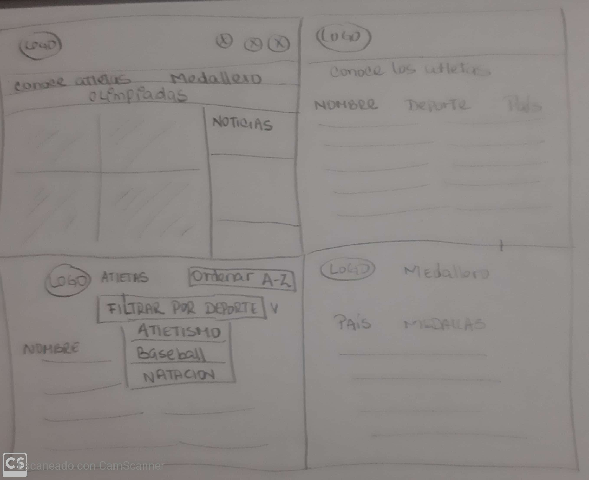
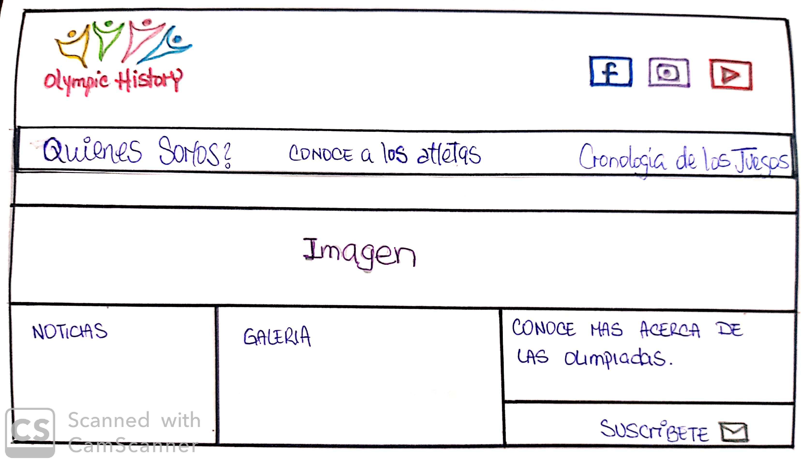
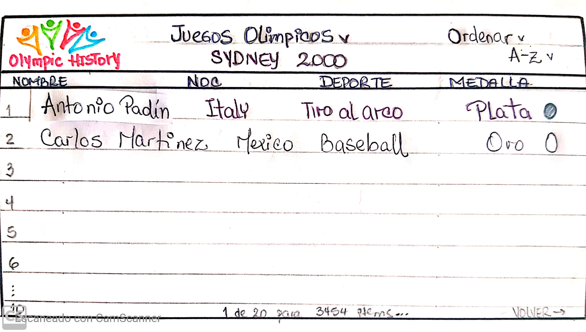
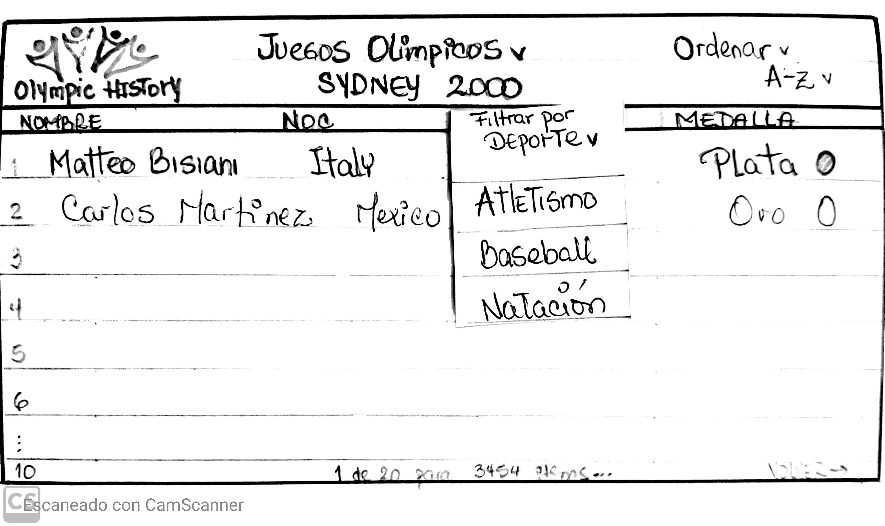
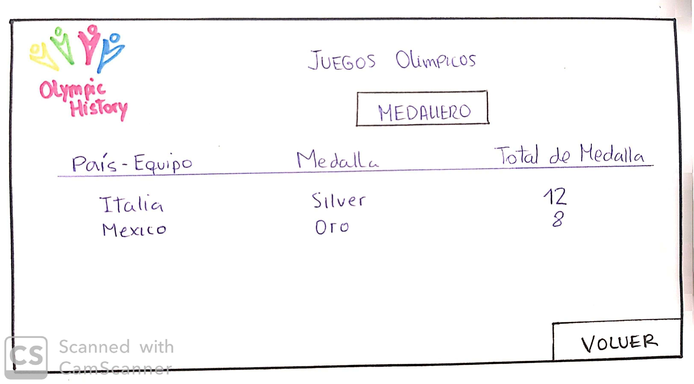
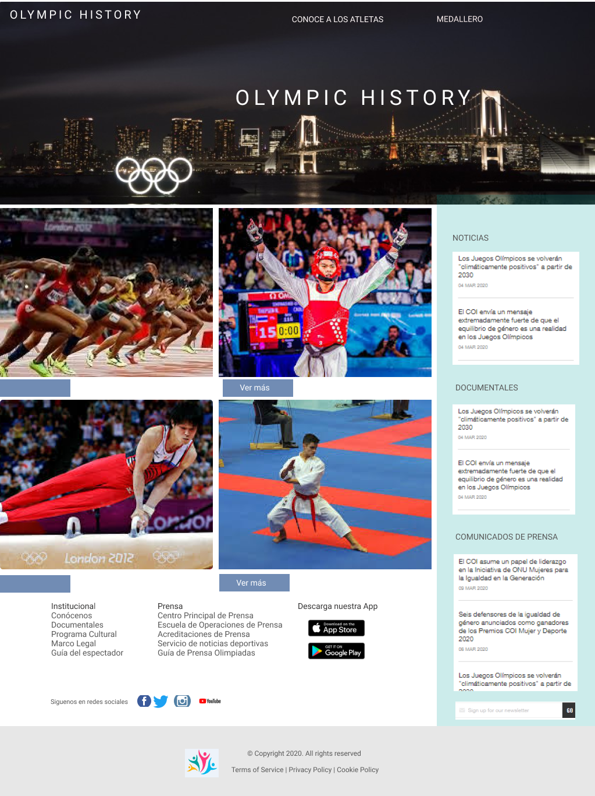
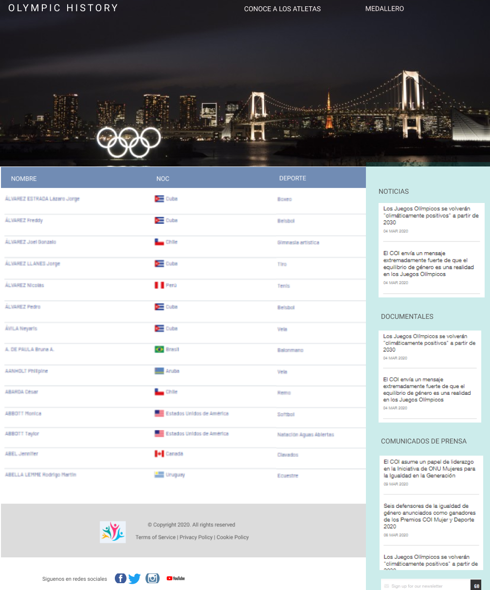
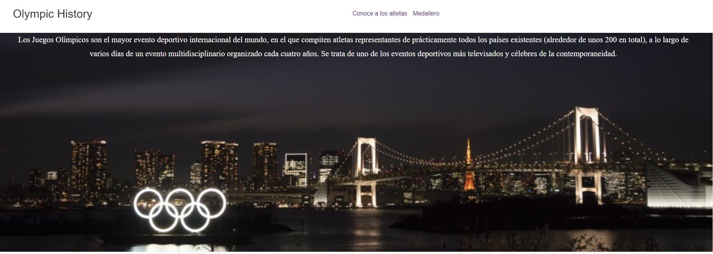
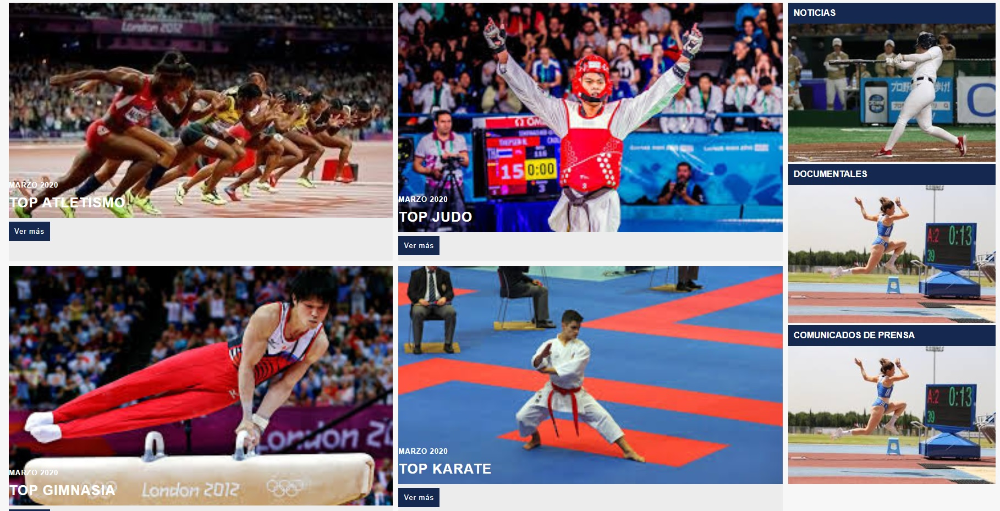
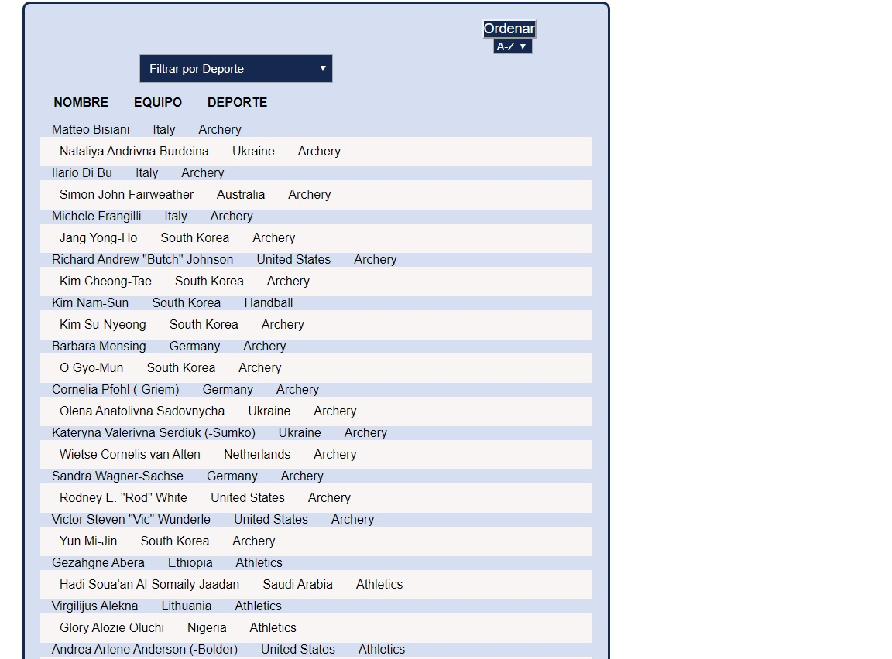

# Data Lovers - Olympic History

## Índice

* [1. Definicion del Proyecto](#1-definicion-del-proyecto)
* [2. Definicion del Producto](#2-definicion-del-producto)
* [3. Historias de Usuarios](#3-historias-de-usuarios)
* [4. Diseño de la interfaz de Usuario](#4-diseño-de-la-interfaz-de-usuario)
* [5. Implementación de la Interfaz de Usuario](#5-implementacion-de-la-interfaz-de-usuario)
* [6. Objetivos-de-aprendizaje](#6-objetivos-de-aprendizaje)
* [7. Checklist](#9-checklist)

***

## 1. Definicion del Proyecto

DATA LOVERS- OLYMPIC HISTORY, es un proyecto desarrollado en equipo (parejas), el proyecto tuvo una duracion de 5 spring (5 semanas). El proceso de planificacion del proyecto fue realizado durante el primer spring, se desarrollaron las diversas historias de usuarios, se realizaron los test de usabilidad y el diseño de la interfaz de usuario, realizado a traves de prototipos de baja y alta fidelidad.

## 2. Definicion del Producto

OLYMPIC HISTORY- Es una web diseñada para usuarios interesados en acceder a la data historica de los Juegos Olimpicos (Periodo de años comprendido entre 2000-2016).

OLYMPIC HISTORY- Permite al usuario visualizar a los atletas por nombre, deporte practicado y pais representado, a partir de esa data, permite ordenarla alfabeticamente y filtrar a los atletas por deporte.

OLYMPIC HISTORY- Contiene un apartado denominado "Medallero", a traves del cual, podemos conocer la cantidad de medallas ganadas (Oro, plata, bronce) filtrados por Olimpiada jugada y pais seleccionado.

## 3. Historias de Usuario

* Historia #1. `FILTRAR Atletas y mostrar (Escoger de toda la data: Nombre, país, deporte) y mostrar en una tabla`.

   Yo como _usuario_ **quiero** ver a los atletas, **para** conocer sus datos básicos (Nombre, país, deporte).

   ### Criterios de Aceptacion   
   .- El usuario deberá hacer clic en la opción "Conoce a los Atletas".
   .- Se debe mostrar la data a través de una tabla que contendrá: Nombre del atleta, país, deporte.

   ### Definicion de Terminado 
   .- El listado a mostrar debe poder verse desde cualquier dispositivo. (RESPONSIVE).
   .- El spring debe estar publicado en el repositorio github.
   .- El código debe pasar las pruebas o tests unitarios.

* Historia #2. `ORDENAR los nombres de los atletas por orden alfabético`.

   Yo como _usuario_ **quiero** poder ordenar los NOMBRES DE ATLETAS de manera alfabética (A-Z), **para** tener una visión organizada de la data.

   ### Criterios de Aceptacion 
   .- El usuario deberá presionar un botón ORDENAR (A-Z), el cual te permitirá visualizar un listado de todos los atletas en forma ordenada alfabéticamente.  
   .- El usuario deberá realizar "Clic" en el botón ordenar para que se pueda ejecutar dicha acción.

   ### Definicion de Terminado 
   .- El listado a mostrar debe poder verse desde cualquier dispositivo. (RESPONSIVE).
   .- El spring debe estar publicado en el repositorio github.
   .- El código debe pasar las pruebas o tests unitarios.

* Historia #3. `Filtrar los nombres de los atletas por tipo de DEPORTE practicado`.

   Yo como _usuario_ **quiero** poder filtrar la búsqueda de ATLETAS por DEPORTES olímpicos, **para** saber cuales son los nombres de los atletas que participaron en ese deporte en especifico. 

   ### Criterios de Aceptacion  
   .- El usuario deberá seleccionar un deporte, de una lista desplegable denominada "Filtrar por Deporte".
   .- Se debe mostrar la data filtrada con todos los atletas que compitieron en el deporte seleccionado. La tabla que contendrá: Nombre del atleta, país, deporte. 

   ### Definicion de Terminado
   .- El listado a mostrar debe poder verse desde cualquier dispositivo. (RESPONSIVE).
   .- El spring debe estar publicado en el repositorio github.
   .- El código debe pasar las pruebas o tests unitarios. 

* Historia #4.- `Contabilizar (SUMAR) la cantidad de medallas ganadas (Oro, plata, bronce) por cada país participante`.

   Yo como _usuario_ **quiero** ver el MEDALLERO, es decir, el total de las medallas ganadas (ORO-PLATA-BRONCE) por cada país, **para** saber los países con mas cantidad de medallas ganadas.

   ### Criterios de Aceptacion 
   .- El usuario deberá hacer clic en el botón "Medallero".
   .- Debera seleccionar una olimpiada que escogera de una lista desplegable.
   .- Debera seleccionar el pais del cual desea visualizar la cantidad de medallas ganadas.
   .- El usuario podrá visualizar la suma de medallas por categoría (Oro-plata-bronce) ganadas para el pais escogido.  

   ### Definicion de Terminado 
   .- El medallero a mostrar debe poder verse desde cualquier dispositivo. (RESPONSIVE).
   .- El spring debe estar publicado en el repositorio github.
   .- El código debe pasar las pruebas o tests unitarios.

## 4. Diseño de la interfaz de Usuario

 ### Prototipo de Baja Fidelidad

  A continuacion los prototipos de baja realizados luego de algunas iteraciones y testeos de usabilidad, durante los cuales, se presentaron problemas como que los usuarios no lograban entender la funcionalidad, por lo cual, se mejoraron los bocetos para que fueron mas intuitivos.

   * Primera Iteracion
   
   * Segunda Iteracion
   
   
   
   
   

  ### Prototipo de Alta Fidelidad

  A continuacion los prototipos de alta fidelidad realizados con la herramienta **Figma** donde se aplicaron los principios de diseño visual para nuestra propuesta final.

   
   

## 5. Implementacion de la interfaz de Usuario.

La implementacion de la interfaz de usuario tardo mas tiempo del planificado, al implementar los primeros springs se demoraron un tiempo mas del planificado, sin embargo, se trabajo para que el proyecto cumpliera con todas las caracteristicas solicitadas. A continuacion algunas imagenes del producto final:

  
  

.- Muestra la data en una interfaz: una tabla.
.- Permite al usuario interactuar para obtener la infomación que necesita: Filtra y ordena la data.

  

## 6. Objetivos de aprendizaje

El objetivo principal de este proyecto es que, entendiendo las necesidades de
tus usuarios, aprendas a diseñar y construir una interfaz web donde se pueda
visualizar y manipular data.

Revisa la lista y reflexiona sobre los objetivos que conseguiste en el
proyecto anterior. Piensa en eso al decidir tu estrategia de trabajo individual
y de equipo.

### UX

- [x] Diseñar la aplicación pensando y entendiendo al usuario.
- [x] Crear prototipos para obtener _feedback_ e iterar.
- [x] Aplicar los principios de diseño visual (contraste, alineación, jerarquía).
- [x] Planear y ejecutar _tests_ de usabilidad.

### HTML y CSS

- [x] Entender y reconocer por qué es importante el HTML semántico.
- [x] Identificar y entender tipos de selectores en CSS.
- [x] Entender como funciona `flexbox` en CSS.
- [x] Construir tu aplicación respetando el diseño planeado (maquetación).

### DOM

- [x] Entender y reconocer los selectores del DOM (`querySelector` | `querySelectorAll`).
- [x] Manejar eventos del DOM. (`addEventListener`)
- [x] Manipular dinámicamente el DOM. (`createElement`, `appendchild`, `innerHTML`, `value`)

### Javascript

- [x] Manipular arrays (`filter` | `map` | `sort` | `reduce`).
- [x] Manipular objects (key | value).
- [x] Entender el uso de condicionales (`if-else` | `switch`).
- [x] Entender el uso de bucles (`for` | `forEach`).
- [x] Entender la diferencia entre expression y statements.
- [x] Utilizar funciones (`parámetros` | `argumentos` | `valor de retorno`).
- [x] Entender la diferencia entre tipos de datos atómicos y estructurados.
- [x] Utilizar ES Modules (`import` | `export`).

### Pruebas Unitarias (_testing_)
- [x] Testear funciones (funciones puras).

### Git y GitHub
- [x] Ejecutar comandos de git (`add` | `commit` | `pull` | `status` | `push`).
- [x] Utilizar los repositorios de GitHub (`clone` | `fork` | `gh-pages`).
- [x] Colaborar en Github (`pull requests`).

### Buenas prácticas de desarrollo
- [x] Organizar y dividir el código en módulos (Modularización).
- [x] Utilizar identificadores descriptivos (Nomenclatura | Semántica).
- [x] Utilizar linter para seguir buenas prácticas (ESLINT).

## 7. Checklist

* [x] Usa VanillaJS.
* [x] No hace uso de `this`.
* [x] Pasa linter (`npm run pretest`)
* [x] Pasa tests (`npm test`)
* [ ] Pruebas unitarias cubren un mínimo del 70% de statements, functions y
  lines y branches.
* [x] Incluye _Definición del producto_ clara e informativa en `README.md`.
* [x] Incluye historias de usuario en `README.md`.
* [x] Incluye _sketch_ de la solución (prototipo de baja fidelidad) en
  `README.md`.
* [x] Incluye _Diseño de la Interfaz de Usuario_ (prototipo de alta fidelidad)
  en `README.md`.
* [ ] Incluye link a Zeplin en `README.md`.
* [x] Incluye el listado de problemas que detectaste a través de tests de
  usabilidad en el `README.md`.
* [x] UI: Muestra lista y/o tabla con datos y/o indicadores.
* [x] UI: Permite ordenar data por uno o más campos (asc y desc).
* [x] UI: Permite filtrar data en base a una condición.
* [x] UI: Es _responsive_.

### Pruebas unitarias

El _boilerplate_ de este proyecto no incluye Pruebas Unitarias (_tests_), así es
que  tendrás que escribirlas tú para las funciones que tenga tu código.
<!--encargadas de  _procesar_, _filtrar_ y _ordenar_ la data, así
como _calcular_ estadísticas.-->

Tus _pruebas unitarias_ deben dar una cobertura del 70% de _statements_
(_sentencias_), _functions_ (_funciones_), _lines_ (_líneas_), y _branches_
(_ramas_) del archivo `src/data.js` que contenga tus funciones y está detallado
en la sección de [Consideraciones técnicas](#srcdatajs).

## Hacker edition

Las secciones llamadas _Hacker Edition_ son **opcionales**. Si **terminaste**
con todo lo anterior y te queda tiempo, intenta completarlas. Así podrás
profundizar y/o ejercitar más sobre los objetivos de aprendizaje del proyecto.

Features/características extra sugeridas:

* En lugar de consumir la data estática brindada en este repositorio, puedes
  consumir la data de forma dinámica, cargando un archivo JSON por medio de
  `fetch`. La carpeta `src/data` contiene una versión `.js` y una `.json` de
  de cada set datos.
* Agregarle a tu interfaz de usuario implementada visualizaciones gráficas. Para
  ello te recomendamos explorar librerías de gráficas como
  [Chart.js](https://www.chartjs.org/)
  o [Google Charts](https://developers.google.com/chart/).
* 100% Coverage

## Consideraciones técnicas

La lógica del proyecto debe estar implementada completamente en JavaScript
(ES6), HTML y CSS. En este proyecto NO está permitido usar librerías o
frameworks, solo [vanilla JavaScript](https://medium.com/laboratoria-how-to/vanillajs-vs-jquery-31e623bbd46e),
con la excepción de librerías para hacer gráficas (charts); ver
[_Parte opcional_](#6-hacker-edition) más arriba.

No se debe utilizar la _pseudo-variable_ `this`.

El _boilerplate_ contiene una estructura de archivos como punto de partida así
como toda la configuración de dependencias:

```text
.
├── EXTRA.md
├── README.md
├── package.json
├── src
|  ├── data (según con qué data trabajes)
|  |  ├── lol
|  |  |  ├── lol.js
|  |  |  ├── lol.json
|  |  |  └── README.md
|  |  ├── pokemon
|  |  |  ├── pokemon.js
|  |  |  ├── pokemon.json
|  |  |  └── README.md
|  |  └── atletas
|  |     ├── atletas.js
|  |     └── atletas.json
|  |     └── README.md
|  ├── data.js
|  ├── index.html
|  ├── main.js
|  └── style.css
└── test
   └── data.spec.js

directory: 6 file: 17
```

### `src/index.html`

Como en el proyecto anterior, existe un archivo `index.html`. Como ya sabes,
acá va la página que se mostrará al usuario. También nos sirve para indicar
qué scripts se usarán y unir todo lo que hemos hecho.

### `src/main.js`

Recomendamos usar `src/main.js` para todo tu código que tenga que ver con
mostrar los datos en la pantalla. Con esto nos referimos básicamente a la
interacción con el DOM. Operaciones como creación de nodos, registro de
manejadores de eventos (_event listeners_ o _event handlers_), ....

Esta no es la única forma de dividir tu código, puedes usar más archivos y
carpetas, siempre y cuando la estructura sea clara para tus compañeras.

En este archivo encontrarás una serie de _imports_ _comentados_. Para _cargar_
las diferentes fuentes de datos tendrás que _descomentar_ la línea
correspondiente.

Por ejemplo, si "descomentamos" la siguiente línea:

```js
// import data from './data/pokemon/pokemon.js';
```

La línea quedaría así:

```js
import data from './data/pokemon/pokemon.js';
```

Y ahora tendríamos la variable `data` disponible en el script `src/main.js`.

### `src/data.js`

El corazón de este proyecto es la manipulación de datos a través de arreglos
y objetos.

Te reomendamos que este archivo contenga toda la funcionalidad que corresponda
a obtener, procesar y manipular datos (tus funciones). Por ejemplo:

* `filterData(data, condition)`: esta función `filter` o filtrar recibiría la
  data, y nos retornaría aquellos datos que sí cumplan con la condición.

* `sortData(data, sortBy, sortOrder)`: esta función `sort` u ordenar
  recibe tres parámetros.
  El primer parámetro, `data`, nos entrega los datos.
  El segundo parámetro, `sortBy`, nos dice con respecto a cuál de los campos de
  la data se quiere ordenar.
  El tercer parámetro, `sortOrder`, indica si se quiere ordenar de manera
  ascendente o descendente.

* `computeStats(data)`: la función `compute` o calcular, nos permitirá hacer
  cálculos estadísticos básicos para ser mostrados de acuerdo a la data
  proporcionada.

Estos nombres de funciones y de parámetros son solamente referenciales, lo que
decidas depende de tu propia implementación.

Estas funciones deben ser [_puras_](https://medium.com/laboratoria-developers/introducci%C3%B3n-a-la-programaci%C3%B3n-funcional-en-javascript-parte-2-funciones-puras-b99e08c2895d)
e independientes del DOM. Estas funciones serán después usadas desde el archivo
`src/main.js`, al cargar la página, y cada vez que el usuario interactúe (click,
filtrado, ordenado, ...).

### `src/data`

En esta carpeta están los datos de las diferentes fuentes. Encontrarás una
carpeta por cada fuente, y dentro de cada carpeta dos archivos: uno con la
extensión `.js` y otro `.json`. Ambos archivos contienen la misma data; la
diferencia es que el `.js` lo usaremos a través de una etiqueta `<script>`,
mientras que el `.json` está ahí para opcionalmente cargar la data de forma
asíncrona con [`fetch()`](https://developer.mozilla.org/es/docs/Web/API/Fetch_API)
(ver sección de [_Parte Opcional_](#6-hacker-edition)).

### `test/data.spec.js`

Tendrás también que completar las pruebas unitarias de las funciones
implementadas en el archivo `data.js`.

## Pistas, tips y lecturas complementarias

### Primeros pasos

Antes de empezar a escribir código, debes definir qué deberá hacer el producto
en base al conocimiento que puedas obtener de tu usuario. Estas preguntas te
pueden ayudar:

* ¿Quiénes son los principales usuarios de producto?
* ¿Cuáles son los objetivos de estos usuarios en relación con el producto?
* ¿Cuáles son los datos más relevantes que quieren ver en la interfaz y por qué?
* ¿Cuándo utilizan o utilizarían el producto?
* Toda tu investigación previa debe tener como resultado todas las Historias
  de Usuario de tu proyecto.
* No hagas los prototipos de alta fidelidad de todas tus Historias. Comienza
  solamente por los que se necesiten para tu Sprint 1 (semana 1 de trabajo). Más
  pistas en la guía de organización para el proyecto.

Cuando ya estés lista para codear, te sugerimos empezar de esta manera:

1. Una de las integrantes del equipo debe realizar un :fork_and_knife:
   [fork](https://help.github.com/articles/fork-a-repo/) del repo de tu cohort,
   tus _coaches_ te compartirán un _link_ a un repo y te darán acceso de lectura
   en ese repo. La otra integrante del equipo deber hacer un fork **del
   repositorio de su compañera** y
   [configurar](https://gist.github.com/BCasal/026e4c7f5c71418485c1) un `remote`
   hacia el mismo.
2. :arrow_down: [Clona](https://help.github.com/articles/cloning-a-repository/)
   tu _fork_ a tu computadora (copia local).
3. 📦 Instala las dependencias del proyecto con el comando `npm install`. Esto
   asume que has instalado [Node.js](https://nodejs.org/) (que incluye [npm](https://docs.npmjs.com/)).
4. Si todo ha ido bien, deberías poder ejecutar las :traffic_light:
   pruebas unitarias (unit tests) con el comando `npm test`.
5. Para ver la interfaz de tu programa en el navegador, usa el comando
  `npm start` para arrancar el servidor web y dirígete a
  `http://localhost:5000` en tu navegador.
6. A codear se ha dicho! :rocket:

<!--
En este proyecto deberás trabajar colaborativamente. Para ello, una de las
integrantes del equipo deberá forkear el repositorio del cohort y la otra
integrante **deberá hacer un fork del repositorio de su compañera**. Luego de
esto, deberás
[configurar](https://help.github.com/articles/configuring-a-remote-for-a-fork/)
un `remote` hacia el repositorio del cual hiciste el fork.

Para mandar cambios desde un repositorio forkeado al original debes crear un
[pull request](https://goo.gl/4bYnuh)
y el propietario del repositorio original recibirá una notificación para
[revisar el pull request](https://goo.gl/XSFcT5)
y [aceptar los cambios](https://goo.gl/HLJtqN).

Aquí algunas recomendaciones para que organices mejor el trabajo con tu
compañera:

* En lugar de trabajar en una sola rama o _branch_, puedes organizar el flujo de
  trabajo con dos ramas principales:
  - `master`: rama que contiene las funcionalidades terminadas y sin errores.
  - `develop`: rama dónde integrarás las funcionalidades conforme las vayas
    desarrollando.

* Además de tener las dos ramas anteriores, puedes trabajar cada nueva
  funcionalidad en una rama individual (_feature branches_), estas ramas en
  lugar de crearse a partir de `master`, tienen a `develop` como su rama de
  origen. Cuando una funcionalidad es terminada se integra de nuevo a `develop`.
  Las _feature branches_ no se deben integrar directamente a `master`.

* Por último, te sugerimos codear usando la técnica de
  [pair programming](https://goo.gl/uAMBX2).

¿Quieres saber más forks y pull requests?

* Un [fork](https://help.github.com/articles/fork-a-repo/) es una copia de un
  repositorio en el que puedes experimentar sin afectar al repositorio original.
  Generalmente se usa para proponer cambios al proyecto de alguien más o para
  usar el proyecto de otra persona como punto de partida para una idea que
  quieras realizar.

* Un [pull request](https://help.github.com/articles/about-pull-requests/) (PR)
  te permite solicitar la inclusión de cambios al repositorio original (tu punto
  de partida) en GitHub. Cuando un PR es abierto, este permite solicitar,
  discutir y revisar los cambios realizados con todos los colaboradores y
  agregar otros commits antes de que los cambios sean incluidos al repositorio
  original.
-->

***

### Contenido de referencia

#### Diseño de experiencia de usuario (User Experience Design)

* Investigación con usuarios / entrevistas
* Principios de diseño visual

#### Desarrollo Front-end

* Unidad de testing en curso de JavaScript en LMS.
* Unidad de arreglos en curso de JavaScript en LMS.
* Unidad de objetos en curso de JavaScript en LMS.
* Unidad de funciones en curso de JavaScript en LMS.
* Unidad de DOM en curso de Browser JavaScript en LMS.
* [Array en MDN](https://developer.mozilla.org/es/docs/Web/JavaScript/Referencia/Objetos_globales/Array)
* [Array.sort en MDN](https://developer.mozilla.org/es/docs/Web/JavaScript/Referencia/Objetos_globales/Array/sort)
* [Array.map en MDN](https://developer.mozilla.org/es/docs/Web/JavaScript/Referencia/Objetos_globales/Array/map)
* [Array.filter en MDN](https://developer.mozilla.org/es/docs/Web/JavaScript/Referencia/Objetos_globales/Array/filter)
* [Array.reduce en MDN](https://developer.mozilla.org/es/docs/Web/JavaScript/Referencia/Objetos_globales/Array/reduce)
* [Array.forEach en MDN](https://developer.mozilla.org/es/docs/Web/JavaScript/Referencia/Objetos_globales/Array/forEach)
* [Object.keys en MDN](https://developer.mozilla.org/es/docs/Web/JavaScript/Referencia/Objetos_globales/Object/keys)
* [Object.entries en MDN](https://developer.mozilla.org/es/docs/Web/JavaScript/Referencia/Objetos_globales/Object/entries)
* [Fetch API en MDN](https://developer.mozilla.org/en-US/docs/Web/API/Fetch_API)
* [json.org](https://json.org/json-es.html)
* [expressions-vs-statements](https://2ality.com/2012/09/expressions-vs-statements.html)
* [expresión vs sentencia](https://openclassrooms.com/en/courses/4309531-descubre-las-funciones-en-javascript/5108986-diferencia-entre-expresion-y-sentencia)
* [datos atomicos vs datos estructurados](https://www.todojs.com/tipos-datos-javascript-es6/)
* [Modulos: Export](https://developer.mozilla.org/es/docs/Web/JavaScript/Referencia/Sentencias/export)
* [Modulos: Import](https://developer.mozilla.org/es/docs/Web/JavaScript/Referencia/Sentencias/import)

#### Herramientas

* [Git](https://git-scm.com/)
* [GitHub](https://github.com/)
* [GitHub Pages](https://pages.github.com/)
* [Node.js](https://nodejs.org/)
* [Jest](https://jestjs.io/)

#### Organización del Trabajo

* [Historias de Usuario](https://www.youtube.com/watch?v=ky6wFiF5vMk&t=344s).
  Ojo que Cris no diferencia _Definición de terminado_ de _Criterios de
  Aceptación_ y nosotros sí lo haremos. Más detalles en la guía.
* [Cómo dividir H.U.](https://www.youtube.com/watch?v=Ueq786iZ30I&t=341s)
* [Guía para Data Lovers](https://docs.google.com/presentation/d/e/2PACX-1vQhx9D36NjpH-Daea-ITPUDUzNL8ZiNAprq_7b5PSUrfutk45tEtaOLz2lmd8f54_5jX1hypDM8f8SM/pub?start=false&loop=false&delayms=60000)